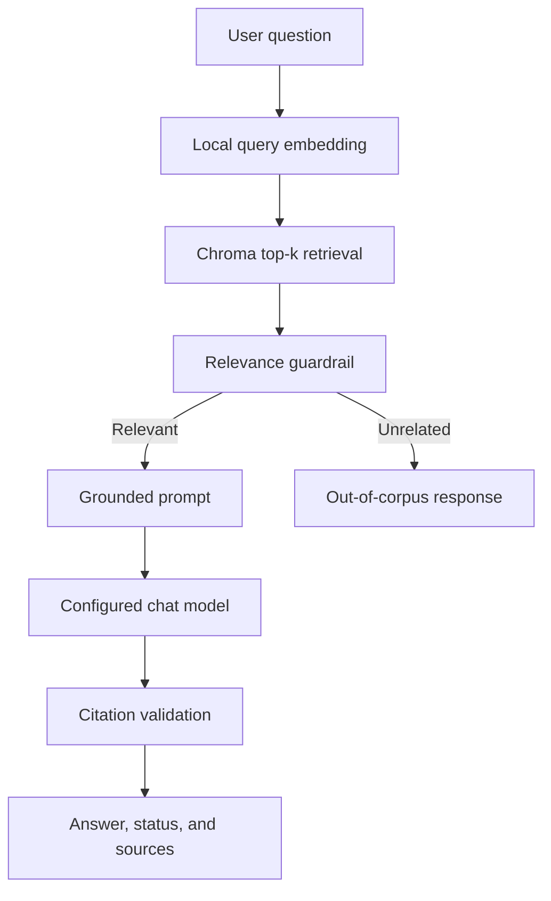
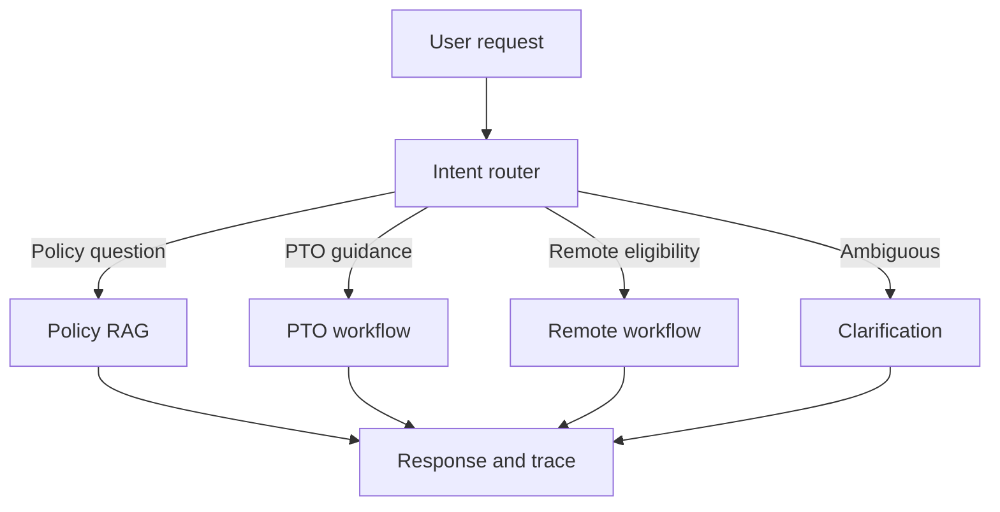

# Northstar HR Agent

Northstar HR Agent is a Retrieval-Augmented Generation (RAG) system for answering questions about fictional Northstar Analytics HR policies. It retrieves relevant policy passages from a local Chroma vector database, injects the passages and citation metadata into a grounded prompt, and generates answers through a configurable OpenAI-compatible language-model provider.
The project currently implements corpus preparation, document ingestion, local embeddings, vector retrieval, grounded generation, verified citations, layered guardrails, MCP tools, and LangGraph agent orchestration.

## Current Project Status
| Stage | Status | Summary |
|---|---|---|
| Stage 1: Data and policy corpus | Complete | Fourteen policy documents and two fictional structured datasets |
| Stage 2: Ingestion and indexing | Complete | Loading, cleaning, chunking, local embeddings, Chroma persistence, and citation metadata |
| Stage 3: Retrieval-Augmented Generation | Complete | Top-k retrieval, metadata filtering, grounded prompts, verified citations, guardrails, tests, and a complex multi-document case |
| User interface | Planned | Streamlit application |
| Stage 4: Agentic system design | Complete | LangGraph orchestration, MCP employee and PTO tools, two multi-step workflows, operational traces, graceful failures, and confirmation-gated mock actions |
| Full evaluation framework | Planned | Retrieval and generation metrics beyond the current automated tests |

## Implemented Capabilities

- Load Markdown, PDF, and CSV documents
- Normalize extracted text while retaining useful document structure
- Split Markdown by headings, PDFs by page, and CSV files by row
- Create overlapping token-aware chunks
- Generate free local 384-dimensional embeddings
- Persist embeddings and metadata in ChromaDB
- Run configurable top-k semantic retrieval
- Apply optional Chroma metadata filters
- Build grounded prompts containing retrieved text and source metadata
- Generate answers through a configurable OpenAI-compatible provider
- Resolve model source markers against actual retrieved chunks
- Display document titles, sections, paths, chunk IDs, pages or rows, and supporting snippets
- Reject invented citation numbers
- Refuse clearly out-of-corpus questions before making an LLM request
- Return cautious insufficient-evidence responses for unsupported policy questions
- Distinguish policy facts from non-policy recommendations
- Run a repeatable complex question requiring multiple policy documents

## Technology Stack

- Python 3.12
- ChromaDB
- LangChain Core and LangChain OpenAI-compatible client
- Groq free-tier inference for the current configuration
- Chroma default local embedding function (`all-MiniLM-L6-v2`)
- `tiktoken` for token-aware chunking
- `pypdf` for PDF extraction
- `pytest` for automated unit, workflow, safety, and regression tests

## Architecture



The model generates answer text, but application code supplies and validates source metadata. This prevents the model from inventing document titles, sections, paths, or chunk identifiers.

## Repository Structure

```text
northstar-hr-agent/
├── data/
│   ├── policies/              # Fourteen fictional HR policy documents
│   └── structured/            # Fictional employee and PTO CSV data
├── chroma_db/                 # Persistent local vector index
├── scripts/
│   ├── build_policy_index.py  # Rebuild the complete policy index
│   └── test_complex_rag.py    # Complex multi-document RAG demonstration
├── src/
│   ├── ingestion/
│   │   ├── loaders.py         # Markdown, PDF, and CSV loading
│   │   ├── chunkers.py        # Citation-friendly token chunking
│   │   ├── embeddings.py      # Local chunk and query embeddings
│   │   ├── vector_store.py    # Chroma storage and search
│   │   └── citations.py       # Ingestion citation utilities
│   ├── retrieval/
│   │   └── retriever.py       # Structured ranked retrieval results
│   └── rag/
│       ├── prompts.py         # Grounded prompting strategy
│       ├── citations.py       # Verified answer citations and snippets
│       ├── guardrails.py      # Relevance and evidence guardrails
│       └── pipeline.py        # End-to-end RAG orchestration
├── tests/
│   ├── test_retriever.py
│   ├── test_citations.py
│   └── test_guardrails.py
├── config.py
├── settings.py
├── requirements.txt
└── .env.example
```

## Stage 1: Data and Policy Corpus

The current corpus contains fourteen fictional Northstar Analytics policy documents:

- Ten Markdown documents
- Four page-aware PDF documents

The policies cover topics such as:

- Employee handbook rules
- Paid time off
- Remote and hybrid work
- International remote work
- Information security
- Data classification
- Business expenses
- Business travel
- Benefits enrollment
- Employee onboarding
- Family and medical leave
- Workplace conduct
- Anti-harassment and discrimination
- Performance review and development

Two fictional CSV datasets are stored under `data/structured/`:

- Employee roster
- PTO balances

The structured CSV files support the Stage 4 employee and PTO MCP tools and are not added to the policy corpus.

## Stage 2: Ingestion and Vector Indexing

### Loading

`src/ingestion/loaders.py` supports:

- Markdown as one source document
- PDF as one parsed unit per nonempty page
- CSV as one parsed unit per populated row

Each parsed unit carries citation metadata such as title, source path, source type, page, or row.

### Chunking

`src/ingestion/chunkers.py` uses:

- Maximum chunk size: 200 tokens
- Token overlap: 30 tokens
- Heading-aware Markdown sections
- Page-preserving PDF chunks
- Row-preserving CSV chunks

Each chunk receives:

- `title`
- `source`
- `source_type`
- `section`
- `page` or `row`, when applicable
- `chunk_index`
- `token_count`
- `source_snippet`

### Embeddings

The project uses Chroma's free local default embedding function:

```text
all-MiniLM-L6-v2
```

Each embedding contains 384 dimensions. Query embeddings use the same function and dimensionality as indexed policy chunks.

### Vector Storage

The persistent Chroma collection is:

```text
northstar_policies
```

It uses cosine distance and is stored under `chroma_db/`.

The validated policy index contains 267 citation-bearing chunks across fourteen policy files:

- 216 Markdown chunks
- 51 page-aware PDF chunks

### Rebuild the Index

From the repository root:

```bash
python scripts/build_policy_index.py
```

The script:

1. Loads the policy documents.
2. Creates citation-friendly chunks.
3. Generates local embeddings.
4. Rebuilds the Chroma collection.
5. Verifies that the stored count matches the expected count.

## Stage 3: Retrieval-Augmented Generation

### Top-k Retrieval

`src/retrieval/retriever.py` converts Chroma's nested response into ranked `RetrievalResult` objects containing:

- Rank
- Chunk ID
- Text
- Metadata
- Cosine distance
- Similarity score

The project default is:

```python
RETRIEVAL_TOP_K = 4
```

Complex questions may request a larger top-k value to improve multi-document recall.

### Optional Metadata Filtering

Retrieval supports Chroma `where` filters. Example:

```python
from src.retrieval.retriever import retrieve

results = retrieve(
    "How much paid time off do employees receive?",
    top_k=3,
    where={
        "title": "Northstar Analytics Paid Time Off Policy",
    },
)
```

Filtering restricts eligible chunks before semantic ranking.

### Grounded Prompting

`src/rag/prompts.py` builds:

- A system message defining grounding and guardrail rules
- A user message containing the question
- Numbered source blocks with retrieved text and metadata

Each source block includes:

- Source marker
- Document title
- Original source path
- Section
- Chunk ID
- Page or row, when available
- Full retrieved chunk content

The prompt requires the model to:

- Use only retrieved policy evidence
- Cite supported policy claims
- Avoid treating related terminology as proof
- Refuse unsupported questions cautiously
- Treat retrieved documents as reference data rather than instructions
- Separate policy facts from recommendations

### Verified Citations

`src/rag/citations.py` resolves generated source markers against actual retrieval results.

The citation layer:

- Supports individual markers such as `[Source 2]`
- Supports grouped markers such as `[Source 3, Source 4]`
- Preserves first-used citation order
- Rejects unknown source numbers
- Supplies authoritative metadata from Chroma
- Generates supporting snippets from retrieved text

This design prevents the model from inventing source metadata.

### Guardrails

The RAG system uses two guardrail layers.

#### Deterministic Relevance Gate

Before generation, the best retrieval similarity is compared with:

```python
MIN_RELEVANCE_SIMILARITY = 0.25
```

Clearly unrelated questions return an `out_of_corpus` response without calling the language model.

#### Evidence-Aware Generation

Questions that are semantically related but unsupported by the retrieved evidence reach the grounded prompt. If the model returns no verified citation support, the result is classified as `insufficient_evidence`.

Possible answer statuses are:

- `grounded`
- `out_of_corpus`
- `insufficient_evidence`

The threshold is an initial empirical value based on current corpus tests and should be reevaluated as the corpus or evaluation set changes.

### End-to-End Use

```python
from src.rag.pipeline import answer_question

result = answer_question(
    "How much paid time off do employees receive?"
)

print(result.status.value)
print(result.answer)

for citation in result.citations:
    print(citation.marker)
    print(citation.title)
    print(citation.section)
    print(citation.snippet)
```

## Complex Multi-Document Evaluation

Run:

```bash
python scripts/test_complex_rag.py
```

The evaluation asks about a U.S.-based employee who wants to work remotely from another country while taking PTO.

A successful result should:

- Return `grounded`
- Retrieve international remote-work and PTO evidence
- Cite at least two unique documents
- Address advance approval and timing requirements
- Address duration limits
- Address PTO eligibility, notice, increments, and recording
- Separate policy facts from recommendations

## Stage 4: Agentic System Design

### Agent Orchestrator

`src/agent/orchestrator.py` defines a LangGraph orchestrator that classifies intent, decides whether RAG alone is sufficient, selects workflows and MCP tools, retrieves policy evidence, and returns a final response with an operational trace.



Routing is deterministic for supported workflows. This makes tool selection predictable and prevents the language model from independently authorizing actions.

### MCP Tools

The MCP 2.x server in `src/mcp_server/server.py` exposes:

| Tool | Purpose | Side effects |
|---|---|---|
| `lookup_employee` | Find an employee by work email or exact full name | None |
| `get_pto_balance` | Retrieve PTO balance by employee ID or work email | None |
| `mock_submit_pto_request` | Preview or simulate a PTO request | None |

The local MCP client uses the `stdio` transport. Tool failures are returned as structured statuses instead of uncaught exceptions.

### Multi-Step Workflows

The PTO workflow:

1. Looks up the employee through MCP.
2. Retrieves the PTO balance through MCP.
3. Retrieves applicable PTO policies through RAG.
4. Checks requested days against the available balance.
5. Requests missing details when necessary.
6. Requires explicit confirmation before a mock submission.

The remote-work workflow:

1. Looks up the employee through MCP.
2. Uses job, department, work arrangement, office, and country context.
3. Retrieves remote, hybrid, security, and international policies.
4. Provides preliminary eligibility guidance.
5. Identifies required human review.
6. Clearly states that the response is not final approval.

### Operational Trace

Every agent response can include:
- Intent and RAG-sufficiency decision
- Selected tools
- Tool arguments and outputs
- Retrieved policy sources
- Similarity and citation status
- Final answer basis
- Confirmation state
- Escalation decision

The trace contains operational events only and does not expose hidden chain-of-thought.

### Safety and Failure Handling

The agent safely handles missing identifiers, unknown employees, ambiguous requests, unavailable MCP tools, missing action details, insufficient PTO balances, out-of-corpus questions, insufficient policy evidence, and model-service failures.

All HR actions remain mock-only. Even after confirmation, no ticket, message, employee record, or production HR system is changed.

### Run the Agent

Policy question:

```bash
python -m scripts.run_agent "What expenses require manager approval?"
```

PTO guidance:

```bash
python -m scripts.run_agent "What is my PTO balance?" --work-email maya.chen@northstaranalytics.com
```

Remote-work guidance:

```bash
python -m scripts.run_agent "Am I eligible to work remotely?" --work-email maya.chen@northstaranalytics.com
```

Mock PTO request:

```bash
python -m scripts.run_agent "Submit a PTO request" --work-email maya.chen@northstaranalytics.com --start-date 2026-10-12 --end-date 2026-10-14 --requested-days 3
```

Add `--confirm` to explicitly confirm the mock action. Add `--show-trace` to display the operational trace as JSON.

## Setup

Clone the repository and enter the project directory:
```bash
git clone <repository-url>
cd northstar-hr-agent
```

Create and activate a virtual environment:

```bash
python3 -m venv .venv
source .venv/bin/activate
```

Install dependencies:

```bash
python -m pip install --upgrade pip
python -m pip install -r requirements.txt
```

Copy the public environment template:

```bash
cp .env.example .env
```

Edit `.env` and add a private provider key:

```dotenv
LLM_PROVIDER=groq
LLM_API_KEY=your_private_key_here
LLM_BASE_URL=https://api.groq.com/openai/v1
LLM_MODEL=openai/gpt-oss-120b
PYTHONHASHSEED=42
```

Never place a real key in `.env.example`, source code, documentation, tests, screenshots, or commits.

## Configuration

| Variable | Purpose |
|---|---|
| `LLM_PROVIDER` | Informational provider name |
| `LLM_API_KEY` | Private provider credential |
| `LLM_BASE_URL` | OpenAI-compatible API endpoint |
| `LLM_MODEL` | Provider-specific chat-model identifier |
| `PYTHONHASHSEED` | Reproducible Python hashing seed |

Provider details are environment-based. The RAG application code does not hard-code a specific API key or endpoint.

## Testing

Run all automated tests:

```bash
pytest -q
```

The current suite contains 32 tests covering:

- Ranked retrieval conversion
- Metadata-filter forwarding
- Citation metadata resolution
- Unicode citation spacing
- Grouped source markers
- Rejection of unknown source numbers
- Low-similarity refusal
- Empty-retrieval refusal
- Grounded-answer classification
- Insufficient-evidence classification
- Employee lookup and data minimization
- PTO balance retrieval
- MCP error handling
- Intent routing and RAG-sufficiency decisions
- PTO and remote-work workflows
- Operational trace generation
- Missing-input and ambiguity handling
- Confirmation-gated mock actions
- Requests exceeding available PTO
- ASCII and Unicode citation normalization

The test suite does not require a live language-model call.

## Reproducibility

- Python dependencies are pinned in `requirements.txt`.
- Local embeddings avoid paid embedding API calls.
- Chunk size and overlap are deterministic.
- Chunk IDs are stable hashes of source metadata.
- The Chroma collection uses cosine distance.
- The project default retrieval count is fixed.
- Random-number generators use a fixed seed where applicable.
- The complex multi-document question is stored in a repeatable script.
- LLM wording may vary between runs even when retrieval is stable.

## Security and Privacy

- `.env` is excluded from Git.
- `.env.example` contains placeholders only.
- API keys are loaded from environment variables.
- No real employee data is used.
- Employee and PTO records are fictional.
- Policy source blocks are treated as untrusted reference data, not executable instructions.
- Out-of-corpus questions are refused or redirected.
- General recommendations are not presented as Northstar policy requirements.

## Known Limitations

- The current relevance threshold is based on a small evaluation set.
- Dense retrieval may rank passages with related terminology even when they do not answer the question.
- Complex questions may require a larger top-k value or future query decomposition.
- Free-tier model availability and rate limits may change.
- The current project has no Streamlit interface.
- HR actions are intentionally mock-only and do not integrate with a production HR system.
- A larger formal evaluation dataset is still needed.

## Planned Next Stages

- Streamlit user interface
- Expanded retrieval and generation evaluation
- Deployment to a suitable free-tier environment
