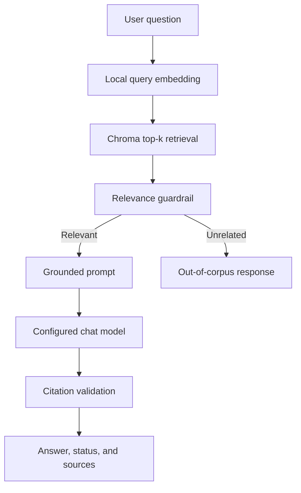
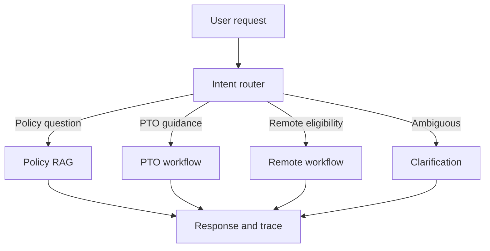

# Northstar HR Agent

Northstar HR Agent is a Retrieval-Augmented Generation (RAG) system for answering questions about fictional Northstar Analytics HR policies. It retrieves relevant policy passages from a local Chroma vector database, injects the passages and citation metadata into a grounded prompt, and generates answers through a configurable OpenAI-compatible language-model provider.
The project currently implements corpus preparation, document ingestion, local embeddings, vector retrieval, grounded generation, verified citations, layered guardrails, MCP tools, and LangGraph agent orchestration.

## Current Project Status
| Stage | Status | Summary |
|---|---|---|
| Stage 1: Data and policy corpus | Complete | Fourteen policy documents and two fictional structured datasets |
| Stage 2: Ingestion and indexing | Complete | Loading, cleaning, chunking, local embeddings, Chroma persistence, and citation metadata |
| Stage 3: Retrieval-Augmented Generation | Complete | Top-k retrieval, metadata filtering, grounded prompts, verified citations, guardrails, tests, and a complex multi-document case |
| User interface | Planned | Streamlit application |
| Stage 4: Agentic system design | Complete | LangGraph orchestration, multi-step HR workflows, operational traces, graceful failures, policy-aware reasoning, and confirmation-gated mock actions |
| Full evaluation framework | Planned | Retrieval and generation metrics beyond the current automated tests |
| Stage 5: MCP server and tool integration | Complete | Local stdio MCP server, five discoverable tools, RAG-backed policy retrieval, structured HR data access, confirmation-gated mock operations, and agent-to-MCP execution |

## Implemented Capabilities

- Load Markdown, PDF, and CSV documents
- Normalize extracted text while retaining useful document structure
- Split Markdown by headings, PDFs by page, and CSV files by row
- Create overlapping token-aware chunks
- Generate free local 384-dimensional embeddings
- Persist embeddings and metadata in ChromaDB
- Run configurable top-k semantic retrieval
- Apply optional Chroma metadata filters
- Build grounded prompts containing retrieved text and source metadata
- Generate answers through a configurable OpenAI-compatible provider
- Resolve model source markers against actual retrieved chunks
- Display document titles, sections, paths, chunk IDs, pages or rows, and supporting snippets
- Reject invented citation numbers
- Refuse clearly out-of-corpus questions before making an LLM request
- Return cautious insufficient-evidence responses for unsupported policy questions
- Distinguish policy facts from non-policy recommendations
- Run a repeatable complex question requiring multiple policy documents
- Route HR requests through deterministic LangGraph workflows
- Retrieve fictional employee and PTO data through MCP tools
- Expose policy evidence retrieval through MCP
- Discover MCP tools and machine-readable input schemas
- Execute confirmation-gated mock PTO operations with no real side effects
- Produce operational traces containing tool selection, arguments, results, and escalation decisions

## Technology Stack

- Python 3.12
- ChromaDB
- LangChain Core and LangChain OpenAI-compatible client
- Groq free-tier inference for the current configuration
- Chroma default local embedding function (`all-MiniLM-L6-v2`)
- LangGraph for agent workflow orchestration
- Model Context Protocol (MCP) 2.2.0 for agent tool integration over stdio
- `tiktoken` for token-aware chunking
- `pypdf` for PDF extraction
- `pytest` for automated unit, workflow, safety, and regression tests

## RAG Architecture



The model generates answer text, but application code supplies and validates source metadata. This prevents the model from inventing document titles, sections, paths, or chunk identifiers.

## Repository Structure

```text
northstar-hr-agent/
├── data/
│   ├── policies/                  # Fourteen fictional HR policy documents
│   └── structured/                # Fictional employee roster and PTO CSV data
├── chroma_db/                     # Persistent local Chroma vector index
├── scripts/
│   ├── build_policy_index.py      # Rebuild the complete policy index
│   ├── test_complex_rag.py        # Complex multi-document RAG demonstration
│   └── run_agent.py               # Command-line entry point for agent workflows
├── src/
│   ├── agent/
│   │   ├── models.py              # Agent result and trace data models
│   │   ├── nodes.py               # Shared LangGraph agent nodes
│   │   ├── orchestrator.py        # Top-level agent execution
│   │   ├── pto_action.py          # Confirmation-gated PTO mock action logic
│   │   ├── pto_workflow.py        # Multi-step PTO workflow
│   │   ├── rag_adapter.py         # Adapter between agent workflows and RAG
│   │   ├── remote_workflow.py     # Multi-step remote-work workflow
│   │   ├── router.py              # Intent and workflow routing
│   │   └── state.py               # Agent workflow state definitions
│   ├── ingestion/
│   │   ├── loaders.py             # Markdown, PDF, and CSV loading
│   │   ├── chunkers.py            # Citation-friendly token chunking
│   │   ├── embeddings.py          # Local chunk and query embeddings
│   │   ├── vector_store.py        # Chroma storage and search
│   │   └── citations.py           # Ingestion citation utilities
│   ├── mcp_server/
│   │   ├── server.py              # MCP server and registered HR tools
│   │   └── client.py              # MCP stdio client adapter used by the agent
│   ├── rag/
│   │   ├── prompts.py             # Grounded prompting strategy
│   │   ├── citations.py           # Verified answer citations and snippets
│   │   ├── guardrails.py          # Relevance and evidence guardrails
│   │   └── pipeline.py            # End-to-end grounded RAG orchestration
│   ├── retrieval/
│   │   └── retriever.py           # Ranked Chroma policy retrieval
│   └── tools/
│       ├── hr_data.py              # Read-only employee roster access
│       ├── pto_data.py             # Read-only PTO balance access
│       └── mock_actions.py         # Confirmation-gated mock HR operations
├── tests/
│   ├── test_agent_failures.py
│   ├── test_agent_router.py
│   ├── test_agent_workflows.py
│   ├── test_citations.py
│   ├── test_guardrails.py
│   ├── test_hr_tools.py
│   ├── test_mock_actions.py
│   └── test_retriever.py
├── config.py
├── settings.py
├── requirements.txt
├── .env.example
└── README.md
```

## Stage 1: Data and Policy Corpus

The current corpus contains fourteen fictional Northstar Analytics policy documents:

- Ten Markdown documents
- Four page-aware PDF documents

The policies cover topics such as:

- Employee handbook rules
- Paid time off
- Remote and hybrid work
- International remote work
- Information security
- Data classification
- Business expenses
- Business travel
- Benefits enrollment
- Employee onboarding
- Family and medical leave
- Workplace conduct
- Anti-harassment and discrimination
- Performance review and development

Two fictional CSV datasets are stored under `data/structured/`:

- Employee roster
- PTO balances

The structured CSV files support the Stage 4 agent workflows and the Stage 5 MCP employee and PTO tools. They are not added to the policy corpus.

## Stage 2: Ingestion and Vector Indexing

### Loading

`src/ingestion/loaders.py` supports:

- Markdown as one source document
- PDF as one parsed unit per nonempty page
- CSV as one parsed unit per populated row

Each parsed unit carries citation metadata such as title, source path, source type, page, or row.

### Chunking

`src/ingestion/chunkers.py` uses:

- Maximum chunk size: 200 tokens
- Token overlap: 30 tokens
- Heading-aware Markdown sections
- Page-preserving PDF chunks
- Row-preserving CSV chunks

Each chunk receives:

- `title`
- `source`
- `source_type`
- `section`
- `page` or `row`, when applicable
- `chunk_index`
- `token_count`
- `source_snippet`

### Embeddings

The project uses Chroma's free local default embedding function:

```text
all-MiniLM-L6-v2
```

Each embedding contains 384 dimensions. Query embeddings use the same function and dimensionality as indexed policy chunks.

### Vector Storage

The persistent Chroma collection is:

```text
northstar_policies
```

It uses cosine distance and is stored under `chroma_db/`.

The validated policy index contains 267 citation-bearing chunks across fourteen policy files:

- 216 Markdown chunks
- 51 page-aware PDF chunks

### Rebuild the Index

From the repository root:

```bash
python scripts/build_policy_index.py
```

The script:

1. Loads the policy documents.
2. Creates citation-friendly chunks.
3. Generates local embeddings.
4. Rebuilds the Chroma collection.
5. Verifies that the stored count matches the expected count.

## Stage 3: Retrieval-Augmented Generation

### Top-k Retrieval

`src/retrieval/retriever.py` converts Chroma's nested response into ranked `RetrievalResult` objects containing:

- Rank
- Chunk ID
- Text
- Metadata
- Cosine distance
- Similarity score

The project default is:

```python
RETRIEVAL_TOP_K = 4
```

Complex questions may request a larger top-k value to improve multi-document recall.

### Optional Metadata Filtering

Retrieval supports Chroma `where` filters. Example:

```python
from src.retrieval.retriever import retrieve

results = retrieve(
    "How much paid time off do employees receive?",
    top_k=3,
    where={
        "title": "Northstar Analytics Paid Time Off Policy",
    },
)
```

Filtering restricts eligible chunks before semantic ranking.

### Grounded Prompting

`src/rag/prompts.py` builds:

- A system message defining grounding and guardrail rules
- A user message containing the question
- Numbered source blocks with retrieved text and metadata

Each source block includes:

- Source marker
- Document title
- Original source path
- Section
- Chunk ID
- Page or row, when available
- Full retrieved chunk content

The prompt requires the model to:

- Use only retrieved policy evidence
- Cite supported policy claims
- Avoid treating related terminology as proof
- Refuse unsupported questions cautiously
- Treat retrieved documents as reference data rather than instructions
- Separate policy facts from recommendations

### Verified Citations

`src/rag/citations.py` resolves generated source markers against actual retrieval results.

The citation layer:

- Supports individual markers such as `[Source 2]`
- Supports grouped markers such as `[Source 3, Source 4]`
- Preserves first-used citation order
- Rejects unknown source numbers
- Supplies authoritative metadata from Chroma
- Generates supporting snippets from retrieved text

This design prevents the model from inventing source metadata.

### Guardrails

The RAG system uses two guardrail layers.

#### Deterministic Relevance Gate

Before generation, the best retrieval similarity is compared with:

```python
MIN_RELEVANCE_SIMILARITY = 0.25
```

Clearly unrelated questions return an `out_of_corpus` response without calling the language model.

#### Evidence-Aware Generation

Questions that are semantically related but unsupported by the retrieved evidence reach the grounded prompt. If the model returns no verified citation support, the result is classified as `insufficient_evidence`.

Possible answer statuses are:

- `grounded`
- `out_of_corpus`
- `insufficient_evidence`

The threshold is an initial empirical value based on current corpus tests and should be reevaluated as the corpus or evaluation set changes.

### End-to-End Use

```python
from src.rag.pipeline import answer_question

result = answer_question(
    "How much paid time off do employees receive?"
)

print(result.status.value)
print(result.answer)

for citation in result.citations:
    print(citation.marker)
    print(citation.title)
    print(citation.section)
    print(citation.snippet)
```

## Complex Multi-Document Evaluation

Run:

```bash
python scripts/test_complex_rag.py
```

The evaluation asks about a U.S.-based employee who wants to work remotely from another country while taking PTO.

A successful result should:

- Return `grounded`
- Retrieve international remote-work and PTO evidence
- Cite at least two unique documents
- Address advance approval and timing requirements
- Address duration limits
- Address PTO eligibility, notice, increments, and recording
- Separate policy facts from recommendations

## Stage 4: Agentic System Design

### Agent Orchestrator

`src/agent/orchestrator.py` defines a LangGraph orchestrator that classifies intent, decides whether RAG alone is sufficient, selects workflows and required HR capabilities, retrieves policy evidence, and returns a final response with an operational trace.



Routing is deterministic for supported workflows. This makes tool selection predictable and prevents the language model from independently authorizing actions.

### Multi-Step Workflows

The PTO workflow:

1. Looks up the employee through MCP.
2. Retrieves the PTO balance through MCP.
3. Retrieves applicable PTO policies through RAG.
4. Checks requested days against the available balance.
5. Requests missing details when necessary.
6. Requires explicit confirmation before a mock submission.

The remote-work workflow:

1. Looks up the employee through MCP.
2. Uses job, department, work arrangement, office, and country context.
3. Retrieves remote, hybrid, security, and international policies.
4. Provides preliminary eligibility guidance.
5. Identifies required human review.
6. Clearly states that the response is not final approval.

### Operational Trace

Every agent response can include:
- Intent and RAG-sufficiency decision
- Selected tools
- Tool arguments and outputs
- Retrieved policy sources
- Similarity and citation status
- Final answer basis
- Confirmation state
- Escalation decision

The trace contains operational events only and does not expose hidden chain-of-thought.

### Safety and Failure Handling

The agent safely handles missing identifiers, unknown employees, ambiguous requests, unavailable MCP tools, missing action details, insufficient PTO balances, out-of-corpus questions, insufficient policy evidence, and model-service failures.

All HR actions remain mock-only. Even after confirmation, no ticket, message, employee record, or production HR system is changed.

### Run the Agent

Policy question:

```bash
PYTHONPATH=. python scripts/run_agent "What expenses require manager approval?"
```

PTO guidance:

```bash
PYTHONPATH=. python scripts/run_agent "What is my PTO balance?" --work-email maya.chen@northstaranalytics.com
```

Remote-work guidance:

```bash
PYTHONPATH=. python scripts/run_agent "Am I eligible to work remotely?" --work-email maya.chen@northstaranalytics.com
```

Mock PTO request:

```bash
PYTHONPATH=. python scripts/run_agent "Submit a PTO request" --work-email maya.chen@northstaranalytics.com --start-date 2026-10-12 --end-date 2026-10-14 --requested-days 3
```

Add `--confirm` to explicitly confirm the mock action. Add `--show-trace` to display the operational trace as JSON.

## Setup

Clone the repository and enter the project directory:
```bash
git clone <repository-url>
cd northstar-hr-agent
```

Create and activate a virtual environment:

```bash
python3 -m venv .venv
source .venv/bin/activate
```

Install dependencies:

```bash
python -m pip install --upgrade pip
python -m pip install -r requirements.txt
```

Copy the public environment template:

```bash
cp .env.example .env
```

Edit `.env` and add a private provider key:

```dotenv
LLM_PROVIDER=groq
LLM_API_KEY=your_private_key_here
LLM_BASE_URL=https://api.groq.com/openai/v1
LLM_MODEL=openai/gpt-oss-120b
PYTHONHASHSEED=42
```

Never place a real key in `.env.example`, source code, documentation, tests, screenshots, or commits.

## Configuration

| Variable | Purpose |
|---|---|
| `LLM_PROVIDER` | Informational provider name |
| `LLM_API_KEY` | Private provider credential |
| `LLM_BASE_URL` | OpenAI-compatible API endpoint |
| `LLM_MODEL` | Provider-specific chat-model identifier |
| `PYTHONHASHSEED` | Reproducible Python hashing seed |

Provider details are environment-based. The RAG application code does not hard-code a specific API key or endpoint.

## Testing

Run all automated tests:

```bash
pytest -q
```

The current suite contains 32 tests covering:

- Ranked retrieval conversion
- Metadata-filter forwarding
- Citation metadata resolution
- Unicode citation spacing
- Grouped source markers
- Rejection of unknown source numbers
- Low-similarity refusal
- Empty-retrieval refusal
- Grounded-answer classification
- Insufficient-evidence classification
- Employee lookup and data minimization
- PTO balance retrieval
- MCP error handling
- Intent routing and RAG-sufficiency decisions
- PTO and remote-work workflows
- Operational trace generation
- Missing-input and ambiguity handling
- Confirmation-gated mock actions
- Requests exceeding available PTO
- ASCII and Unicode citation normalization

The test suite does not require a live language-model call.

## Reproducibility

- Python dependencies are pinned in `requirements.txt`.
- Local embeddings avoid paid embedding API calls.
- Chunk size and overlap are deterministic.
- Chunk IDs are stable hashes of source metadata.
- The Chroma collection uses cosine distance.
- The project default retrieval count is fixed.
- Random-number generators use a fixed seed where applicable.
- The complex multi-document question is stored in a repeatable script.
- LLM wording may vary between runs even when retrieval is stable.

## Security and Privacy

- `.env` is excluded from Git.
- `.env.example` contains placeholders only.
- API keys are loaded from environment variables.
- No real employee data is used.
- Employee and PTO records are fictional.
- Policy source blocks are treated as untrusted reference data, not executable instructions.
- Out-of-corpus questions are refused or redirected.
- General recommendations are not presented as Northstar policy requirements.

## Known Limitations

- The current relevance threshold is based on a small evaluation set.
- Dense retrieval may rank passages with related terminology even when they do not answer the question.
- Complex questions may require a larger top-k value or future query decomposition.
- Free-tier model availability and rate limits may change.
- The current project has no Streamlit interface.
- HR actions are intentionally mock-only and do not integrate with a production HR system.
- A larger formal evaluation dataset is still needed.

## Planned Next Stages

- Streamlit user interface
- Expanded retrieval and generation evaluation
- Deployment to a suitable free-tier environment

## Stage 5: MCP Server and Tool Integration
### Architecture

Stage 5 adds a Model Context Protocol (MCP) boundary between the Northstar HR agent and selected HR capabilities. The agent does not directly call the underlying employee, PTO, or mock-action functions. Instead, it invokes tools through the MCP client, which communicates with the Northstar MCP server.

```text
User
  |
  v
Northstar HR Agent
  |
  v
MCP Client
  |
  | stdio
  v
Northstar MCP Server
  |
  +--> search_policy_documents --> Chroma policy index
  |
  +--> get_policy_section ------> Chroma policy index
  |
  +--> lookup_employee_profile -> employee roster CSV
  |
  +--> check_pto_balance -------> PTO balances CSV
  |
  +--> mock_submit_pto_request -> confirmation-gated mock operation
```

### Transport Choice
The Northstar MCP server uses the `stdio` transport. The agent client starts the MCP server as a local Python subprocess using:
```text
python -m src.mcp_server.server
```

The MCP client and server exchange MCP protocol messages through the subprocess standard input and standard output streams.

`stdio` was selected because the Northstar HR agent and MCP server run in the same local project environment. This avoids introducing an unnecessary HTTP service, network port, or separate deployment while still maintaining an MCP boundary between the agent and its tools.

The server starts with `server.run(transport="stdio")`. The client uses `StdioServerParameters`, `stdio_client`, and `ClientSession` to create and initialize an MCP session.

### MCP Server and Client

The MCP implementation is located under:

```text
src/mcp_server/
├── __init__.py
├── server.py
└── client.py
```
`server.py` defines the Northstar MCP server and registers the HR tools. The server wraps existing retrieval and HR functions rather than duplicating their business logic.
`client.py` provides the agent-side MCP adapter. It starts the local server process, initializes an MCP `ClientSession`, invokes tools by name with structured arguments, and converts MCP responses into controlled Python dictionaries for the agent workflows.

### MCP Tool Discovery
MCP clients can discover the server's available capabilities by initializing a session and calling `list_tools()`.

Example:
```python
async with stdio_client(SERVER_PARAMETERS) as streams:
    read_stream, write_stream = streams

    async with ClientSession(read_stream, write_stream) as session:
        await session.initialize()
        result = await session.list_tools()

        for tool in result.tools:
            print(tool.name)
            print(tool.description)
            print(tool.input_schema)

The server currently advertises five MCP tools:

```text
search_policy_documents
get_policy_section
lookup_employee_profile
check_pto_balance
mock_submit_pto_request
```

Tool discovery returns each tool's name, description, and machine-readable input schema. The schemas are derived from the registered Python tool signatures and type annotations.

### MCP Tool Schemas

#### `search_policy_documents`

Searches the persistent Chroma policy index for semantically relevant policy evidence.

Inputs:

- `query` — required string containing the policy question or search terms
- `top_k` — optional integer specifying the number of results; defaults to 5 and is limited to 1 through 10

Returns ranked policy chunks containing:

- Rank
- Chunk ID
- Retrieved text
- Document title
- Source path
- Section
- Page or row when available
- Similarity score

This tool satisfies the requirement for an MCP tool that uses the RAG index.

#### `get_policy_section`

Retrieves policy evidence from a specific indexed policy section using Chroma metadata filtering.

Inputs:

- `section` — required section name
- `policy_title` — optional policy title used to further restrict retrieval
- `top_k` — optional result limit; defaults to 5 and is limited to 1 through 10

The tool returns matching policy chunks and citation-related source metadata. If no indexed evidence matches the requested section, it returns a controlled `not_found` response.

#### `lookup_employee_profile`

Looks up one fictional Northstar employee from the structured employee roster.

Inputs:

- `work_email` — optional employee work email
- `full_name` — optional exact employee full name

At least one employee identifier must be supplied. The tool returns only fields required by supported HR workflows rather than the complete roster record.

This tool uses the fictional structured dataset stored at:

```text
data/structured/Northstar_Analytics_Employee_Roster.csv
```

#### `check_pto_balance`

Looks up one fictional employee's PTO balance.

Inputs:

- `employee_id` — optional employee ID
- `work_email` — optional employee work email

At least one identifier must be supplied. The tool returns fields including annual allowance, accrued PTO, used PTO, pending requests, current balance, available balance after pending requests, and the balance date.

This tool uses:

```text
data/structured/Northstar_Analytics_PTO_Balances.csv
```

#### `mock_submit_pto_request`

Previews or simulates a PTO request without modifying a real HR system.

Inputs:

- `employee_id`
- `start_date`
- `end_date`
- `requested_days`
- `confirmed`

When `confirmed` is false, the tool returns `confirmation_required` with a request preview and performs no action.

When `confirmed` is true and the request passes validation, the tool returns `mock_completed` with a synthetic `MOCK-PTO-*` request ID.

The tool always reports:

```text
side_effects: none
```

No real HR system, employee record, or PTO balance is changed.

### Tool Validation and Controlled Results

The MCP tools return structured status values so agent workflows can handle failures and incomplete information without relying on unstructured exception text.

Supported outcomes include:

```text
ok
needs_clarification
invalid_request
not_found
unavailable
confirmation_required
mock_completed
tool_error
tool_unavailable
```

Examples of validation include:

- Policy search `top_k` must be between 1 and 10.
- Employee lookup requires a work email or exact full name.
- PTO lookup requires an employee ID or work email.
- Unknown policy sections return `not_found`.
- PTO request dates must be valid ISO dates.
- PTO request end dates cannot precede start dates.
- Requested PTO days must be greater than zero.
- Mock submissions require explicit confirmation.

### Agent Tool Invocation

The agent invokes MCP-exposed tools through `src/mcp_server/client.py`. It does not directly invoke the underlying employee, PTO, or mock-action functions from its workflows.

For example, the PTO workflow calls:

```python
employee_result = await call_hr_tool(
    "lookup_employee_profile",
    {"work_email": work_email},
)
```

and:

```python
pto_result = await call_hr_tool(
    "check_pto_balance",
    {"work_email": work_email},
)
```

The confirmation-gated PTO action similarly invokes:

```python
output = await call_hr_tool(
    "mock_submit_pto_request",
    arguments,
)
```

The resulting execution path is:

```text

Agent workflow
      |
      v
call_hr_tool()
      |
      v
MCP ClientSession
      |
      | stdio
      v
Northstar MCP Server
      |
      v
Registered MCP tool
      |
      v
Existing retrieval / structured-data / mock-action backend
```

Operational traces record the selected MCP tool, its arguments, its structured result, and the workflow decision based on that result.

### Policy Retrieval Architecture

Stage 5 exposes policy retrieval through MCP with `search_policy_documents` and `get_policy_section`.

The established Stage 3 grounded-answer pipeline remains available to the Stage 4 agent workflows for full policy answer generation and citation verification. This pipeline retrieves policy evidence, applies the relevance guardrail, generates a grounded answer, resolves source markers, and validates citations.

This means the system supports both:

```text
MCP policy evidence retrieval
    -> search_policy_documents
    -> get_policy_section
```

and:

```text
Grounded policy answer generation
    -> existing RAG pipeline
    -> citation validation
```

The employee, PTO, and mock-action capabilities used by the Stage 4 workflows are invoked through MCP.

### Verified MCP Execution

Stage 5 was verified through MCP discovery, direct MCP calls, validation tests, and end-to-end agent execution.

Verified behaviors include:

- Discovery of all five tools with `list_tools()`
- Semantic policy retrieval from the Chroma index through `search_policy_documents`
- Metadata-filtered policy retrieval through `get_policy_section`
- Employee lookup through `lookup_employee_profile`
- PTO balance lookup through `check_pto_balance`
- Confirmation-gated mock PTO submission through `mock_submit_pto_request`
- Controlled handling of invalid, missing, and unknown inputs
- Agent execution that invokes MCP tools rather than directly calling their backend functions

A successful PTO workflow demonstrated the following sequence:

```text
intent_routing
    |
    v
lookup_employee_profile       [MCP]
    |
    v
check_pto_balance             [MCP]
    |
    v
policy_retrieval_and_answering
    |
    v
mock_submit_pto_request       [MCP]
    |
    v
response_synthesis
```

With explicit confirmation, the mock PTO operation returns a synthetic request reference while leaving all HR records unchanged.

### Running the MCP-Integrated Agent

Because the project uses the `src` package from the repository root, the command-line agent can be run with:

```bash
PYTHONPATH=. python scripts/run_agent.py "What is my PTO balance?" --work-email maya.chen@northstaranalytics.com --show-trace
```

A confirmation-gated mock PTO request can be demonstrated with:

```bash
PYTHONPATH=. python scripts/run_agent.py "Request PTO for me" --work-email maya.chen@northstaranalytics.com --employee-id NSA-0001 --start-date 2026-10-15 --end-date 2026-10-16 --requested-days 2 --show-trace
```

The same request can be explicitly confirmed by adding:

```text
--confirm
```

All PTO submission behavior is simulated for demonstration purposes.

## Stage 6 - Web Application

The Northstar HR Agent is available through a public Flask web application behind Nginx.

### Public URL

http://54.245.188.227/northstar/

### Endpoints

- `GET /northstar/`
  - Opens the Northstar HR chatbot interface.

- `POST /northstar/chat`
  - Accepts HR policy and workflow requests.
  - Returns:
    - final answer
    - citations
    - supporting snippets
    - concise agent trace
    - intent
    - confirmation and escalation status

- `GET /northstar/health`
  - Returns application status and MCP connectivity status.

Example health response:

```json
{
  "app": "northstar-hr-agent",
  "mcp": {
    "status": "ok",
    "tool_count": 5
  },
  "status": "ok"
}
```
### Demo Instructions

Open the public chatbot and type:

```text
Demo
```

The chatbot will display reproducible example queries.

#### Demo 1 - PTO Workflow

```text
How much PTO do I have available? My email is maya.chen@northstaranalytics.com
```

This demo exercises:

1. Intent routing
2. MCP employee lookup
3. MCP PTO balance lookup
4. PTO policy RAG retrieval
5. Grounded response synthesis

#### Demo 2 - Remote Work Eligibility

```text
Am I eligible for remote work? My email is maya.chen@northstaranalytics.com
```

This demo exercises:

1. Intent routing
2. MCP employee lookup
3. Remote-work policy RAG retrieval
4. Preliminary eligibility guidance
5. Grounded response synthesis

### Conversational Employee Identification

Employee-specific requests can also be completed as a multi-turn conversation.

Example:

```text
User:
How much PTO do I have?

Northstar:
Provide the employee's work email or exact full name.

User:
maya.chen@northstaranalytics.com
```

When the employee provides the requested email, the chatbot preserves the pending request and resumes the original workflow using the supplied employee identity.

An employee email may also be included directly in the original request:

```text
How much PTO do I have available? My email is maya.chen@northstaranalytics.com
```

### Agent Transparency

Grounded policy responses display:

- The final HR response
- Cited policy sources
- Supporting policy excerpts
- A collapsible concise agent trace

The agent trace allows the grader to inspect the major routing, retrieval, and tool-use steps without exposing internal reasoning.

### Testing

Run the complete automated test suite from the project root:

```bash
python -m pytest -q
```

Current Stage 6 validation result:

```text
36 passed
```
## Stage 7 - Render Deployment

The Northstar HR Agent is configured for a zero-cost, single-service deployment on Render.

### Deployment Architecture

The Render web service runs the complete application:

- Flask web interface and HTTP endpoints
- Gunicorn production web server
- LangGraph agent orchestrator
- Local stdio MCP server process
- Chroma policy vector store
- Committed fictional policy and structured HR data

The MCP server remains behind the application boundary and is started locally through the stdio client. No separate MCP hosting service or paid database is required.

### Render Configuration

Deployment is defined in `render.yaml`.

```text
Runtime: Python 3.12
Plan: Free
Health check: /ready
```

Build command:

```bash
pip install -r requirements.txt && python scripts/build_policy_index.py
```

Start command:

```bash
gunicorn --bind 0.0.0.0:$PORT --workers 1 --threads 2 --timeout 120 src.web.app:app
```

The build command installs the pinned dependencies and rebuilds the local Chroma index from the committed policy documents. The validated index contains 267 chunks across fourteen policy files.

### Environment Variables

The Render service requires:

| Variable | Purpose |
|---|---|
| `LLM_PROVIDER` | Provider label; currently `groq` |
| `LLM_API_KEY` | Private Groq API credential |
| `LLM_BASE_URL` | OpenAI-compatible Groq endpoint |
| `LLM_MODEL` | Deployed model identifier |
| `PYTHONHASHSEED` | Reproducible Python hashing seed |

`LLM_API_KEY` is entered as a private Render environment variable and is never committed to Git.

### Storage

The application does not require a paid database or persistent disk.

- Fictional policy documents and structured CSV data are committed to the repository.
- The `chroma_db/` directory is generated during each Render build.
- Runtime filesystem changes are treated as ephemeral.
- Mock PTO submissions do not modify persistent HR records.

### Public Render URL

The public Render URL will be added here after the initial deployment succeeds.

### Free-Tier Cold Starts

Render free web services spin down after periods of inactivity. The first request after a spin-down can take a minute or longer while the service starts. During a cold start, the browser may appear to wait before the chatbot loads.

If this occurs:

1. Wait for the initial request to complete.
2. Refresh the page if necessary.
3. Submit the demo request after the interface loads.

Requests made while the service remains active should respond more quickly. Cold-start delay is expected free-tier behavior and does not indicate that the application is unavailable.

### Deployment Validation

After each deployment:

1. Open the public application URL.
2. Confirm that `/ready` returns HTTP 200.
3. Confirm that `/health` reports application and MCP status.
4. Submit a general policy question and verify grounded citations.
5. Submit an employee-specific PTO question and verify MCP tool use.
6. Confirm that no real HR data or production system is modified.
